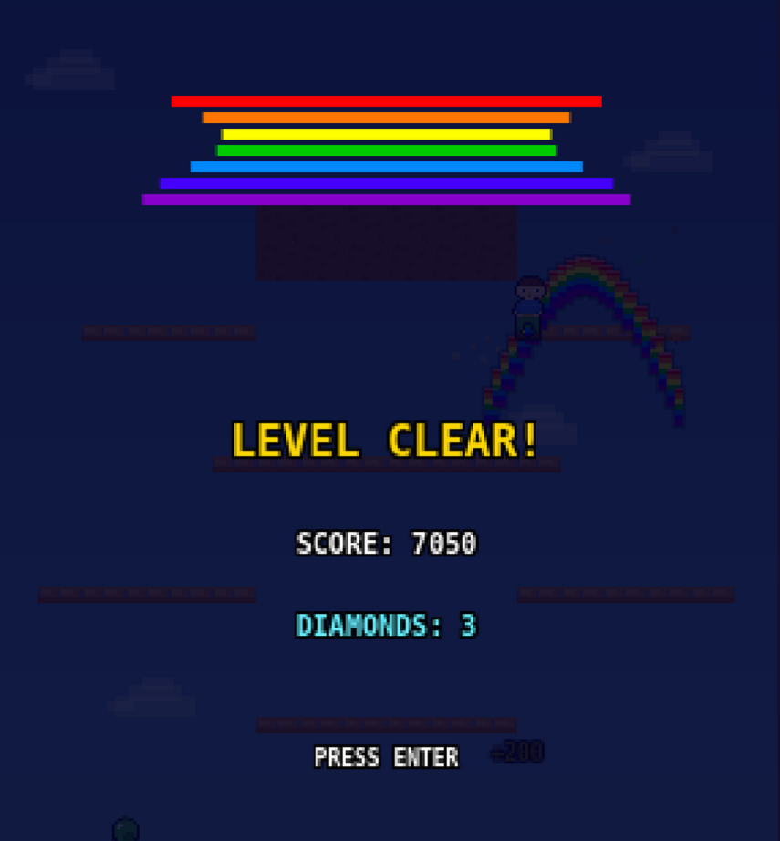

# Rainbow Islands

A 2D platformer inspired by Rainbow Islands: The Story of Bubble Bobble 2. Climb vertical levels using rainbow bridges as weapons and platforms while avoiding enemies and outrunning rising water.

Built with pure HTML5 Canvas and vanilla JavaScript - no frameworks, no dependencies, no build step.

## Play

**[Play on GitHub Pages](https://smidigbommen.github.io/rainbow-island/)**

Or run locally:
```bash
git clone git@github.com:SmidigBommen/rainbow-island.git
cd rainbow-island
python3 -m http.server 8000
# Open http://localhost:8000
```

## Controls

| Key | Action |
|-----|--------|
| Arrow Keys / WASD | Move |
| Space / Z / Up | Jump |
| X / C | Shoot Rainbow |
| Enter | Start / Confirm |
| Escape | Pause |

## Gameplay

- **Climb upward** through each level before the rising water catches you
- **Shoot rainbows** that arc upward - use them as platforms to reach higher ground
- **Defeat enemies** by hitting them with rainbows - they drop fruit, diamonds, and power-ups
- **Collect diamonds** for big bonus points
- **Power-ups**: Speed shoes, rainbow potions (extra rainbows), stars (screen clear), hearts (extra life)
- **Level select**: Beat levels to unlock the next island
- **Leaderboard**: Enter your initials when you get a high score

## Features

- Polished platformer physics (coyote time, jump buffering, variable jump height)
- 4 enemy types with distinct AI patterns
- Procedurally generated pixel art sprites
- Synthesized retro sound effects (Web Audio API)
- Persistent high score leaderboard (localStorage)
- 8 levels across 4 island themes with unlock progression
- Level select screen with difficulty indicators
- Particle effects and screen shake
- Works on any modern browser, deployable to GitHub Pages

## Screenshots



## Tech

- **Zero dependencies** - pure HTML5 Canvas + vanilla JS
- **ES modules** - clean code organization, no bundler needed
- **~4,800 lines** of JavaScript across 17 modules
- **No assets to load** - all sprites and audio generated at runtime

## License

MIT
